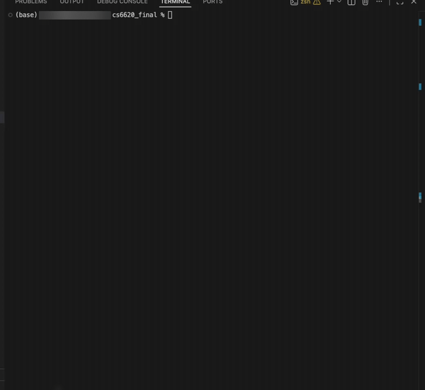
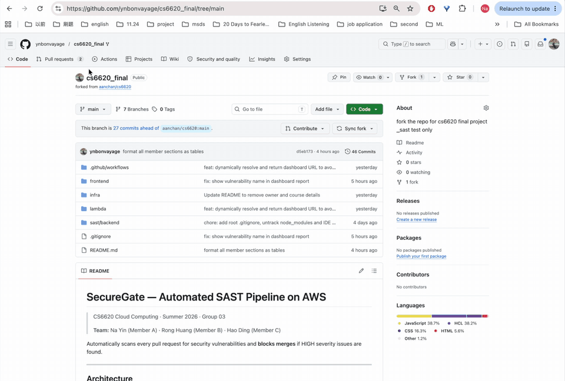
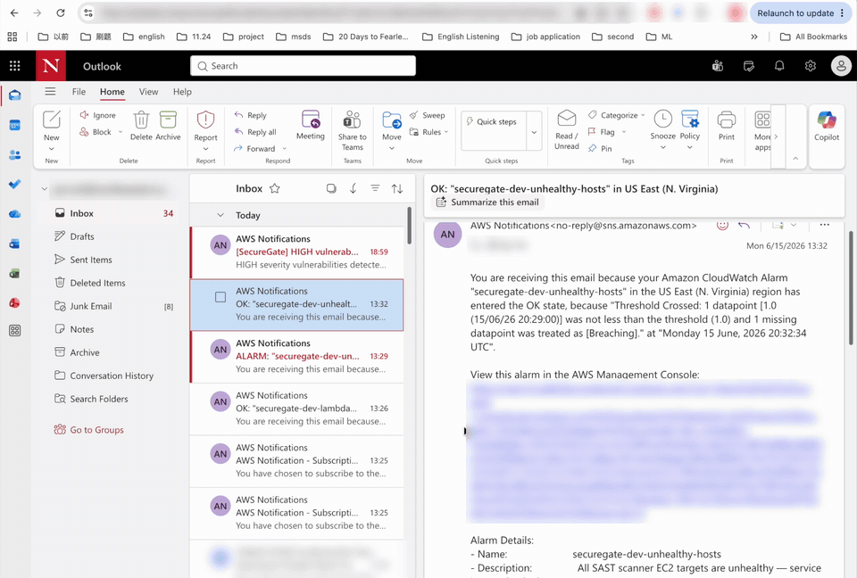
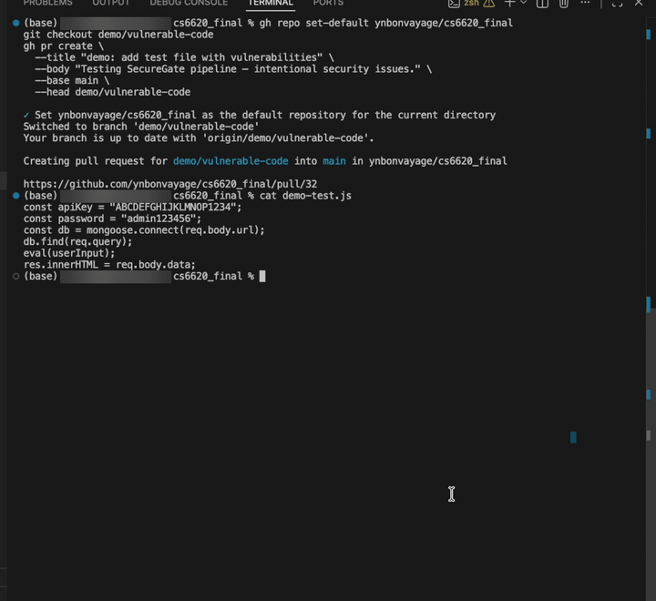
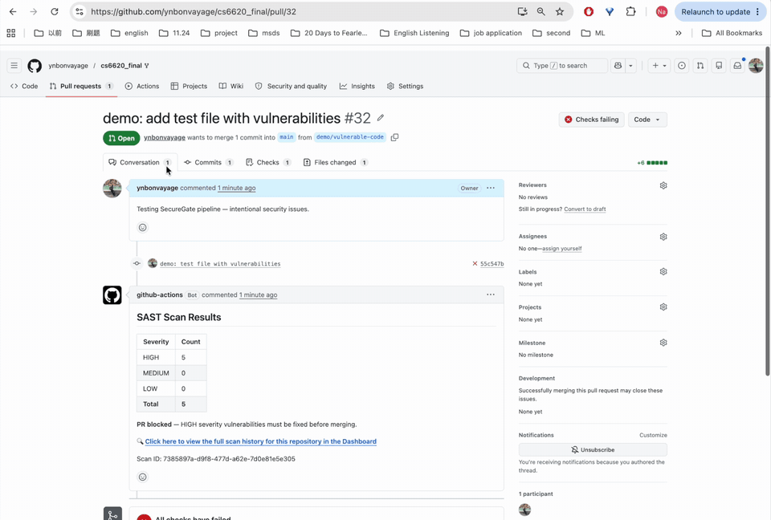
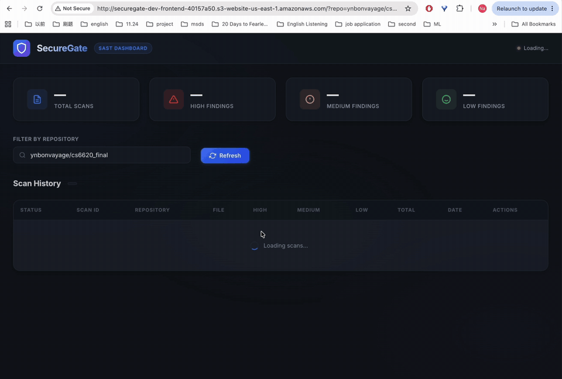
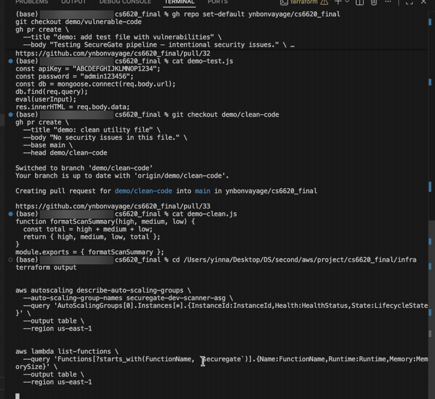
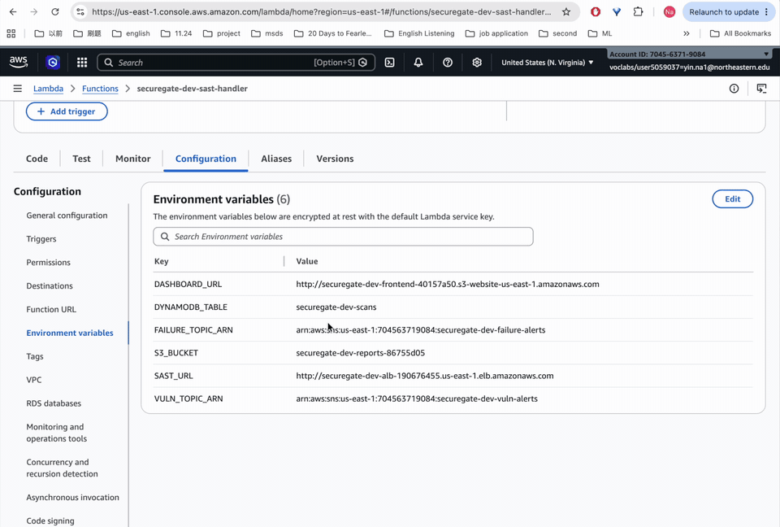
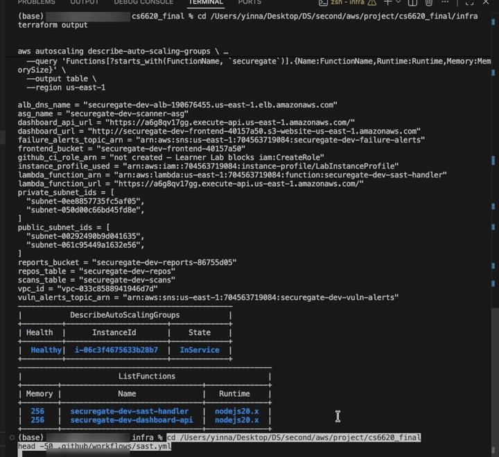

# SecureGate — Automated SAST Pipeline on AWS

> CS6620 Cloud Computing · Summer 2026 · Group 03
>
> **Team:** Na Yin (Member A) · Rong Huang (Member B) · Hao Ding (Member C)

Automatically scans every pull request for security vulnerabilities and **blocks merges** if HIGH severity issues are found.

---

## Demo — Step by Step

Two PRs go through the same pipeline: one with vulnerable code and one with clean code. The GIFs are sped-up clips from our final demo recording.

### Step 1 · Open a PR with vulnerable code

`demo-test.js` contains hardcoded secrets, NoSQL injection from `req.query`, `eval` on user input and `innerHTML` from user data. A PR from `demo/vulnerable-code` is opened with `gh pr create`.



### Step 2 · Scan finds HIGH issues → PR blocked

GitHub Actions runs the scan and the bot posts a severity table (**HIGH 5**). The workflow exits with code 1, so the PR shows **All checks have failed** and cannot be merged. The comment links to the dashboard.



### Step 3 · SNS email alert

Because HIGH findings were found, SNS `vuln-alerts` sends an email with the repo, scan ID, severity summary, S3 report path and a dashboard link.



### Step 4 · Open a PR with clean code

`demo-clean.js` is a small utility function with nothing to flag. A second PR is opened from `demo/clean-code`.



### Step 5 · Clean PR passes

Same pipeline, different code: **HIGH 0**, **All checks have passed** and the merge is allowed. No alert email is sent.



### Step 6 · Dashboard: scan history and report viewer

The S3-hosted dashboard lists every scan for the repo as a PASS or FAIL row, with totals at the top. **View Report** loads the full finding list from S3, with severity, rule, line and the code that triggered it.



---

## Architecture

```
Developer opens PR
        │
        ▼
GitHub Actions (sast.yml)
  differential scan: only JS files added/modified in this PR
        │  POST JSON payload (jq-encoded)
        ▼
API Gateway v2 (HTTP API)
  replaces Lambda Function URL — Learner Lab SCP blocks InvokeFunctionUrl
        │
        ▼
Lambda  sast-handler
  parses request → calls scanner → persists results → returns summary
        │  POST /scan/code
        ▼
ALB (public subnet) → EC2 ASG (private subnet, Docker)
  regex-based SAST engine, 11 vulnerability rule categories
        │
        ├──► DynamoDB  scan summaries (queryable by repo via GSI)
        ├──► S3        full vulnerability reports (Glacier after 30 days)
        └──► SNS       vuln-alerts (HIGH found) · failure-alerts (scanner down)
        │
        ▼
GitHub Actions posts PR comment with severity table
  HIGH > 0      → exit 1 → PR merge blocked
  scanner down  → exit 2 → PR merge blocked
  no JS changes → exit 0 → scan skipped

Dashboard (read path):
API Gateway → Lambda dashboard-api → DynamoDB + S3 → S3 static frontend
```

---

## Under the Hood

What the demo runs on: the deployed resources, how the Lambda is wired, and how the workflow picks which files to scan.

### Deployed infrastructure

`terraform output` lists the live resources: ALB, API Gateway, DynamoDB tables, S3 buckets and SNS topics. The ASG has a healthy, in-service scanner instance. Both Lambda functions (`sast-handler` and `dashboard-api`) are deployed.



### Lambda wiring

The handler's environment variables wire it to the scanner (`SAST_URL`), DynamoDB, S3, both SNS topics and the dashboard URL used in the PR comment.



### Differential scan in `sast.yml`

In `sast.yml`, `git diff --diff-filter=AM` against the base branch picks only the JS files added or modified in the PR. The payload is built with `jq`, so code content is escaped safely before it is sent to the API.



---

## Team Responsibilities

**Member A — Na Yin (SAST Pipeline + Data Layer)**

| Component | Description |
|-----------|-------------|
| `lambda/sast-handler` | Receives scan requests via API Gateway, calls EC2 scanner via ALB, persists results to DynamoDB + S3, returns scan summary |
| `API Gateway v2` | Replaced Lambda Function URL — Learner Lab SCP blocks `InvokeFunctionUrl` from outside AWS |
| `sast.yml` | GitHub Actions workflow: differential scan (only changed JS files), jq JSON encoding, PR comment with severity table, exit 1 (HIGH found) / exit 2 (scanner down) |
| `data layer` | DynamoDB table schema (`scan_id` PK + GSI `repo-created_at-index`), S3 reports bucket with lifecycle policy |
| `monitoring` | CloudWatch alarm (`HealthyHostCount < 1`) + SNS `failure-alerts` → email when all EC2 instances go unhealthy |

**Member B — Rong Huang (Infrastructure)**

| Module | Resources |
|--------|-----------|
| `network` | VPC (10.0.0.0/16), 2 public + 2 private subnets across 2 AZs, IGW, NAT Gateway, ALB (internet-facing, port 80), security groups |
| `compute` | Launch template (Amazon Linux 2023, IMDSv2 enforced), ASG (desired 2, min 1, max 3, CPU 60% scale-out), rolling instance refresh |
| `iam` | Uses pre-provisioned `LabInstanceProfile` (Academy blocks `iam:CreateRole`) |
| `data` | DynamoDB tables (`scans` + `repos`), S3 reports bucket (encryption, versioning, lifecycle), SNS `vuln-alerts` + `failure-alerts` |
| `dashboard` | S3 frontend bucket, static website hosting, API Gateway routes (Terraform provisioning) |

**Member C — Hao Ding (Scanner + Dashboard)**

| Component | Description |
|-----------|-------------|
| `sast/backend` | Node.js Express server on EC2 (Docker), 11 vulnerability rule categories (regex-based), `/health` endpoint for ALB health checks |
| `lambda/dashboard-api` | Reads scan history from DynamoDB via GSI, fetches full reports from S3, enforces per-repo isolation (no full-table scans) |
| `frontend/` | S3 static website: scan history table, vulnerability report modal with type / severity / line / evidence |
| `SNS vuln-alerts` | Email notification when HIGH severity vulnerabilities are detected in a scan |

---

## Deploy

```bash
# 1. Refresh AWS credentials from Learner Lab → paste into ~/.aws/credentials

# 2. Deploy
cd infra
terraform init
terraform apply

# 3. Update GitHub secret with the new API Gateway URL
gh secret set AWS_LAMBDA_URL \
  --body "$(terraform output -raw lambda_function_url)" \
  --repo ynbonvayage/cs6620_final
```

> **Note:** The API Gateway URL changes on every fresh `terraform apply` from empty state. Always update the `AWS_LAMBDA_URL` secret after redeploying.

---

## Repository Structure

```
cs6620_final/
├── .github/workflows/sast.yml       # A · GitHub Actions SAST pipeline
├── lambda/
│   ├── sast-handler/index.mjs       # A · Lambda orchestrator
│   └── dashboard-api/index.mjs      # C · Dashboard read API
├── frontend/                         # C · Dashboard static website
├── infra/
│   └── modules/
│       ├── network/                  # B · VPC, ALB, subnets, NAT
│       ├── compute/                  # B · EC2 ASG, launch template
│       ├── iam/                      # B · LabInstanceProfile
│       ├── data/                     # A+B · DynamoDB, S3, SNS, CloudWatch
│       ├── lambda/                   # A · Lambda + API Gateway
│       └── dashboard/                # B · Dashboard infra provisioning
└── sast/backend/                     # C · Scanner engine (Node.js + Docker)
```

---

## AWS Academy Notes

- Credentials expire every ~4 hours — re-paste from Learner Lab each session
- `iam:CreateRole` is blocked — all resources use `LabRole` / `LabInstanceProfile`
- `terraform apply -refresh=false` if read APIs are denied mid-session
